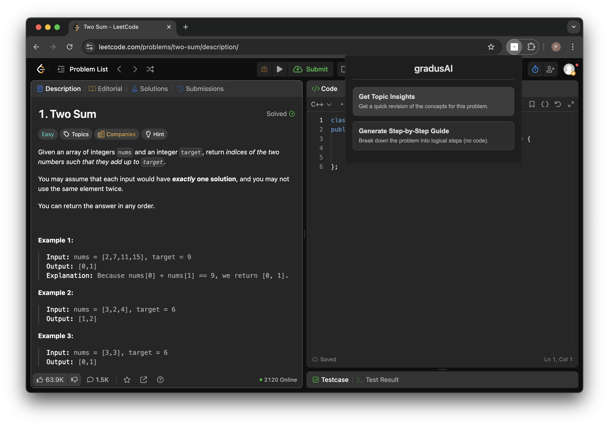
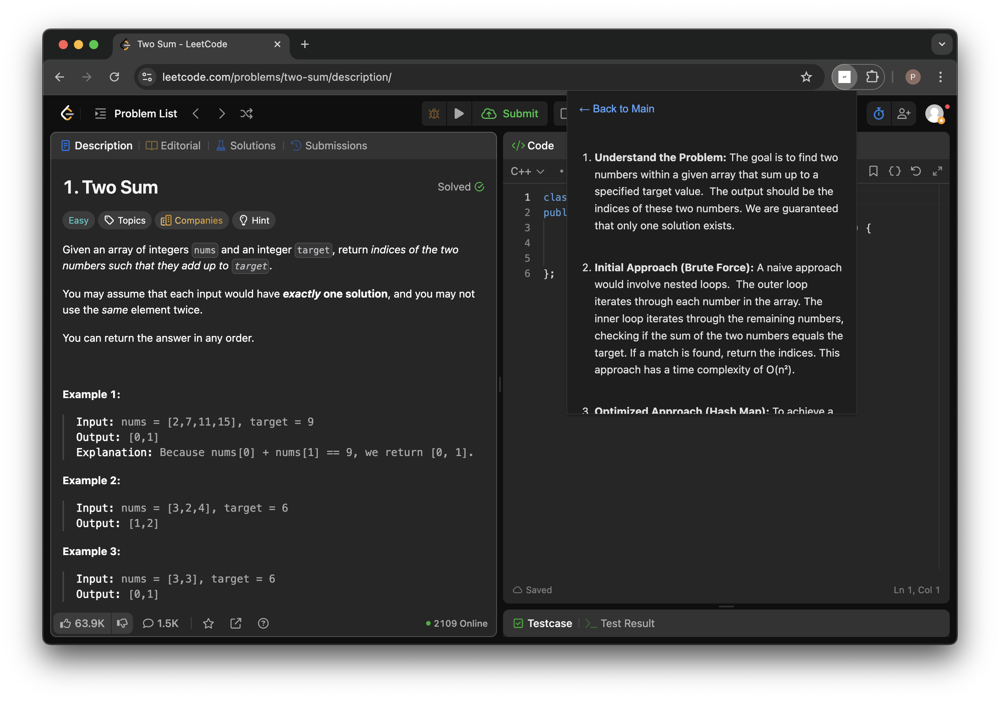

# gradusAI
GradusAI is a Chrome extension that helps students solve LeetCode problems more effectively.

## Setup Instructions

1. Clone this repository to your local machine.
2. In the project folder, find the file named `config.example.js`.
3. Rename it to `config.js`.
4. Open `config.js` and paste in your personal Google Gemini API key.
5. Load the extension into Chrome using the "Load unpacked" button in `chrome://extensions` (make sure developer mode is toggeled on).

## Implementation

Here are some screenshots of GradusAI in action:

### Screenshot 1

### Screenshot 2

